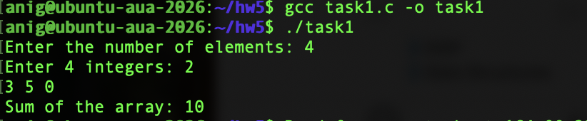
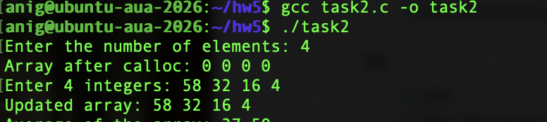
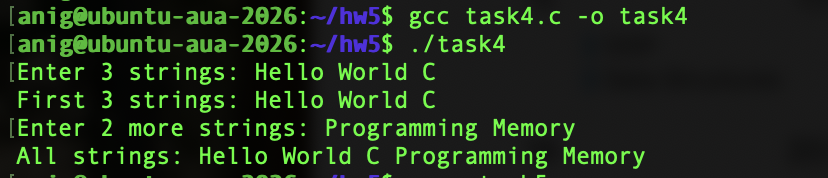
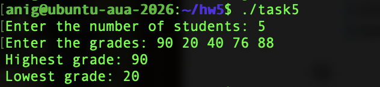

# Dynamic Memory Allocation in C

This assignment contains five C programs that demonstrate how to allocate, resize, and free memory using `malloc()`, `calloc()`, `realloc()`, and `free()`.

## Repository files

Keep `README.md`, the five source files (`task1.c` through `task5.c`), and the five screenshots (`task1.png` through `task5.png`) in the same folder so the image links below display correctly on GitHub.

## Compile and run

Use GCC to compile each program, then run it in a terminal on Linux or macOS:

```bash
gcc task1.c -o task1
./task1

gcc task2.c -o task2
./task2

gcc task3.c -o task3
./task3

gcc task4.c -o task4
./task4

gcc task5.c -o task5
./task5
```

## Task 1: Integer array and sum

[Source code](task1.c)

The program asks for the number of integers and uses `malloc()` to allocate an array. It reads the values, calculates their sum, prints the result, and frees the memory.

In the screenshot, the values `2, 3, 5, 0` give a sum of `10`.



## Task 2: Zero-initialized array and average

[Source code](task2.c)

The program uses `calloc()` to allocate an integer array initialized to zero. It prints the initial values, reads the user's integers, and prints the updated array and its average. A `double` is used for the sum and average to preserve the decimal part. The memory is freed afterward.

For the values `58, 32, 16, 4`, the average is `27.50`.



## Task 3: Shrinking an array

[Source code](task3.c)

The program allocates space for 10 integers using `malloc()` and reads their values. It then uses `realloc()` to shrink the array to five integers. The first five values are preserved and printed before the memory is freed.

A temporary pointer stores the result of `realloc()`. If resizing fails, the original pointer is still available so its memory can be freed.


## Task 4: Expanding a string array

[Source code](task4.c)

The program allocates an array of three character pointers and separate memory for each string. Each string has 51 bytes of storage: up to 50 input characters plus the ending null character (`'\0'`).

After reading and printing the first three strings, the program uses `realloc()` to expand the pointer array to five elements. It allocates memory for two more strings, reads them, and prints all five strings. Finally, it frees each string and then the pointer array.

Input uses `%50s`, so each string is a space-separated word, as shown in the assignment example.



## Task 5: Highest and lowest student grades

[Source code](task5.c)

The program asks for the number of students and allocates an integer array for their grades using `malloc()`. It reads the grades and starts with the first grade as both the highest and lowest. It compares the remaining grades, prints the results, and frees the memory.

In the screenshot, the grades `90, 20, 40, 76, 88` give a highest grade of `90` and a lowest grade of `20`.



## Memory management

All programs check whether allocation succeeds and whether the required input is read successfully. Previously allocated memory is freed before exiting on an error. Tasks 3 and 4 use temporary pointers for `realloc()` so the original allocations are not lost if resizing fails.
